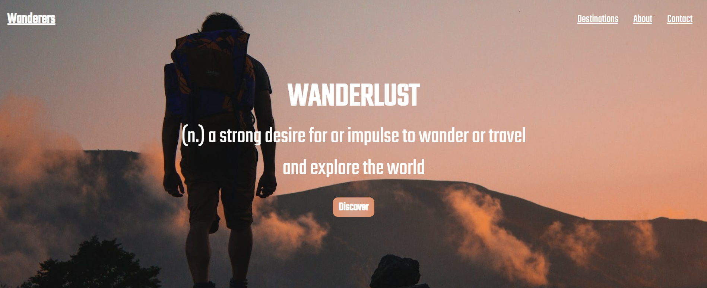

# Wanderers

Welcome to Wanderers! This is website for a fictional company called Wanderers. Wanderers is a company that provides people with a community of like minded people who want to explore everything the world has to offer. Travel can be daunting especially on your own, but with a community of wanderers at your back it will make the experience will be much more enjoyable.  

[Wanderers Live Website here](https://patrickmurphy22.github.io/Wanderers/index.html)

# Table of Contents

____

1. [Overview](#overview)
2. [Features](#features)  
    * [The Header](#the-header)
    * [The landing section](#the-landing-section)
    * [The Citys Section](#a-back-to-top-link)
    * [The Footer](#the-footer)
    * [The About Page](#the-about-page)
    * [The Destinations Page](#the-destinations-page)
    * [The Contact Page](#the-contact-page)
    * [The Location Pages](#the-location-pages)
    * [Future Features](#future-features)
3. [User Experience (UX)](#user-experience-ux)
    * [Strategy](#strategysite-goals)
    * [Scope](#scopeuser-stories)
    * [Structure](#structuredesign-choices)
    * [Skeleton](#skeletonwireframes)
    * [Surface](#surface)
4. [Technologies](#technologies)
5. [Testing](#testing)
    * [Validator](#validator-testing)
    * [Lighthouse](#lighthouse-testing)
6. [Bugs](#bugs)
7. [Citation of Sources](#citation-of-sources)
    * [Content](#content)
    * [Media](#media)
8. [Acknowledgements](#acknowledgements)

---
# Overview

The purpose of this project is to demonstrate my abilities in HTML and CSS. 

It's responsive on Desktop, Tablets and Mobiles and works on multiple browsers. 

The purpose of this website is to provide everyone and anyone the opportunity to travel with a community of like minded individuals. It's for everyone.

Memebers of the community will be able to see what locations are being ventured to over the next 3 months. They can sign up to newsletters to see what dates the community will be at each location 

---

## The Header

  Shown an all pages of the website.
  
  The header includes:
  
1. The title of the page  which contains a link to the landing page.
2. 3 links, Destinations, About and Contact which will take the user to each corresponding page. 
3. When screen size is reduced the 3 links will turn into a burger icon containing all 3 links.

### Header on desktops.

### Header on mobile & tablet screens

## The Landing Section

   The Home page consists of a full screen hero image and text. This is to make the user experience much more streamlined and simple rather than overwhelming the user    with to many options.
   
### Landing Section on Desktops

   
## The Citys Section
   
   The city section contains the 3 cities that are on the communities travel list for the next 3 months. This section has several different features.
   
   On Desktop's, the feature will be a hover action that displays the name of the location over the image which users can click on to take them directly to the city's    page.
   
### City Section on Desktop

### City Section on Tablet / Mobile

   
